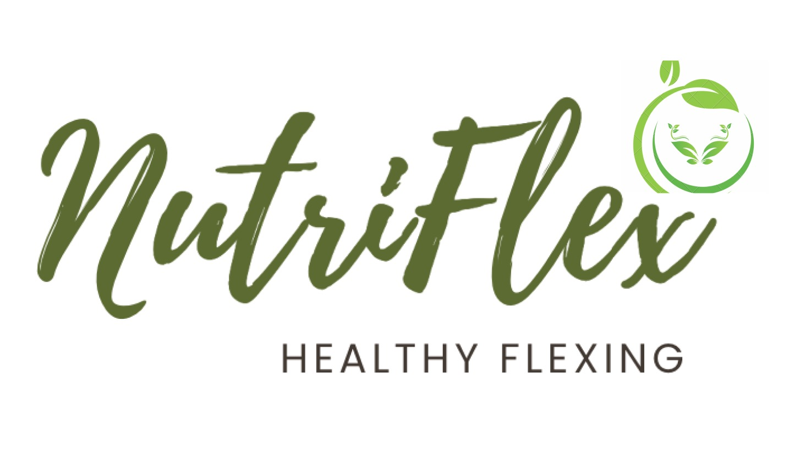

# NutriFlex - CodeBrew 2024

Coded by Rooptop Coders in CodeBrew 2024.

## Inspiration
In many parts of the world, particularly in developed countries such as Australia, 
over-nutrition and obesity are significant concerns. Diets high in processed foods, sugars, unhealthy fats, 
and low in fruits, vegetables, and whole grains contribute to this imbalance.
While over-nutrition is a problem in many regions, malnutrition persists as a significant issue, particularly in developing countries. This includes under-nutrition (not consuming enough nutrients), as well as micronutrient deficiencies such as iron, iodine, and vitamin A deficiencies.
Poor nutrition is associated with a range of health problems, including cardiovascular disease, diabetes, certain cancers, and micronutrient deficiencies leading to conditions like anemia, goiter, and night blindness.

So what can modern tech do to help addressing this global nutrition challenge? What is the main reason behind nutrition imbalance? By our survey and observation, one major reason is that people do not have sufficient knowledge about the nutrition in their daily food!

It will clearly not possible for everyone to be an expert in nutrient and keep track on their daily meal, so the Rooftop Coders
decide to lend a helping hand by utilizing modern AI technology, computer vision along with knowledge in daily nutrition intake, we
developed NutriFlex aiming to help users get to know their food, understanding what nutrients are in their food and getting advices on 
daily nutrient intake.

## What is NutriFlex
NutriFlex is a revolutionary healthy Flexing product designed to help users bid farewell to illness, prevent diseases through dietary therapy, and embrace a life of enjoyment and well-being. Our app assists users in identifying and analyzing food ingredients to derive nutritional components such as calories, protein, fat, fiber, carbohydrates, water, vitamins, and minerals, enabling users to monitor their health indicators effectively. 

The highlight of our product lies in its ability to cater to diverse user needs, particularly dietary-restricted individuals such as diabetes patients and those with food allergies. Once high sugar content or allergens are detected in food items, real-time alerts are automatically generated. Additionally, historical data is stored in a database, allowing for tracking on a weekly, monthly, or quarterly basis, and personalized services are provided as needed.

Users can also customize their own dietary reports, empowering them to pursue their culinary desires boldly. Even for indulgent treats like desserts, we offer healthier ingredient alternatives while maintaining taste, ensuring zero burden on the body.

NutriFlex is more than just an app; it's a lifestyle transformation tool that encourages users to enjoy a healthier, happier life through nutritious food choices. Join us in the journey towards a brighter, more vibrant future with NutriFlex.

NutriFlex also has a sector where it enables user to post and share their healthy lifestyle with the community and have a chance to compete with their peers on healthy lifestyle.

## How NutriFlex achieve it
For the UI/UX we used Figma to craft our Web Pages and Product Application from framing ideas to innovative designs. Themed with green, representing the healthy life. We also explored plugins with some communities, such as icon8, lightningCode, enhancing efficiency in creating.

For the backend, we use Google Vision API for image labeling and GPT 3.5 API for nutrient information. The code are mainly written in Node.js and label
selection part is written in python. 

The flow of work begin with user's web browser or webapp requests the pages on server, then user upload a photo of food from either camera or local file,
then NutriFlex will use Google Cloud Vision API on image labeling and image localization to generate sets of possible food labels. These labels will be 
cross selected from our food type data to output the final food type label. Next the label will be feed to OpenAI API to return the nutrient information within those 
food types along with each nutrient's amount, these data will be stored in database and compared with recommend nutrient 
intake amount for user's physical information to give the final nutrition advice.

## Challenges we ran into
The biggest challenge we got is how to make a function to let user using either camera or upload file from frontend UI to backend so
that we can perform further actions on the photo, this challenge is tackled by examine multiple webapps with similar function and trying to reverse the code
from these websites.

## Achievements we are proud of
In NutriFlex, we select a unique idea by aiming at the common social problem and trying to deliver a solution by utilizing modern edge technology, with help of existing APIs and 
help from artificial intelligence, we managed to deliver a functional webapp from very bottom in a short amount of time.

## What we learned
1) Interaction between frontend and backend.
2) Deploy API and maintain artificial intelligence model.
3) High pressure coding and debugging.
4) The impact of modern technology can do to traditional social problems.
5) Figma skills (with powerful functions inside the plugins)

## Future improvements
1) More detailed product level food type database for a better food type detection.
2) Deploy an offline database on nutrient of common food type to avoid unnecessary GPT API usage.
3) Deploy a fine-tuned image labeling model with specific training on food for better food labelling.
4) More user customization option on physical information to create more in person nutrient suggestion.

## Figma for webpage & application design
https://www.figma.com/file/SIcZVNTxvac2eCEhIybuNS/FOOD-APP?type=design&node-id=0-1&mode=design&t=4MSiolaG0jEb9kVC-0

## <a name="prevAndRun">Preview and Run the project</a>
### <a name="setupBackendENV">Setup Backend .env</a>
1) Navigate to the **backend**
2) Edit **.env** (Create one if not exist)

### <a name="prevEntire">Entire Project</a>
1) Navigate to the **project root folder**
2) Install dependencies: `npm run install:concurrently`
3) Run Entire project and view it in browser: `npm run start:concurrently`

### <a name="prevFrontend">Frontend Only</a>
1) Navigate to the **project root folder**
2) Install dependencies: `npm install:frontend`
3) Run Frontend Only and view it in browser: `npm run start:frontend`

### <a name="prevBackend">Backend Only</a>
1) Navigate to the **project root folder**
2) Install dependencies: `npm install:backend`
3) Run Backend Only and view it in browser: `npm run start:backend`
